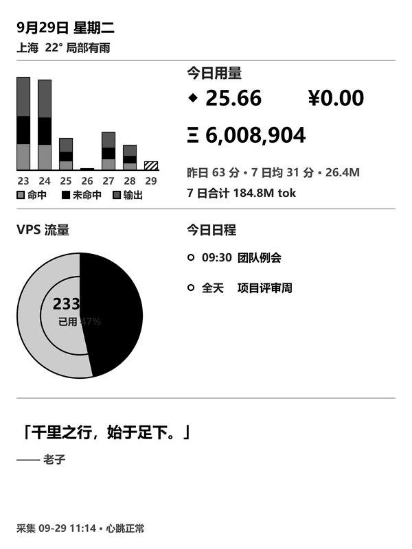

# Kindle InkBoard · 墨水屏仪表盘

> 一块越狱 Kindle，变成自托管的墨水屏仪表盘：AI 用量、VPS 流量、iCloud 日程、天气、每小时一格的金句。**深度睡眠调度下续航以「天」计（实测 4~9 天一充电）。**



English | [中文](#中文)

---

## English

A jailbroken Kindle (PaperWhite/Kindle 10th gen class, 600×800 e-ink) pulls a PNG rendered on your own server and paints it to the screen with `eips`. No browser, no framework — just a shell loop, a Python renderer, and deep sleep between refreshes.

**Features**

- **Weeks-long battery** — the device sleeps (`rtcwake` alarm) between refreshes; wake → fetch PNG → `eips` → sleep. Nothing runs on the Kindle between cycles.
- **Server-side rendering** — 600×800 PNG with 12× supersampling, PIL-based; crisp small text on e-ink.
- **Data sources** (all optional, degrade gracefully):
  - AI usage: daily credits / cost / tokens / cache-hit bars (from your own local usage DB)
  - VPS traffic: single-station donut (via vnstat on any Linux box, collected over SSH)
  - iCloud calendar: today's remaining events via CalDAV (read-only)
  - Weather: wttr.in, 30-min cache
  - Quote of the hour: your own `quotes.txt` (pairs great with the open [hitokoto](https://github.com/hitokoto-osc/sentences-bundle) sentence corpus)
- **Failure philosophy** — stale-data watermark, heartbeat, watchdog, idempotent restarts, "never turn off WiFi" rule; every stage has a timeout and a fallback.

### Architecture

```
┌──────────────┐   render every 15 min    ┌────────────┐   cron: wget → eips   ┌────────┐
│ PC/Mac (xN)  │ ───────────────────────▶ │  Server     │ ────────────────────▶ │ Kindle │
│ collectors   │   merge → render → push  │  (any VPS)  │   every ~59 min,      │ e-ink  │
└──────────────┘   (SSH / shared disk)    └────────────┘   then deep sleep      └────────┘
```

### Quick start

1. **Render a board** (no Kindle needed):
   ```bash
   python renderer/board_renderer.py --data data/board_latest.example.json --out demo.png
   ```
2. **Serve it**: any static HTTP server; point `URL` in the Kindle config at the PNG.
3. **Kindle side**: jailbreak first (we used the open-source [SpiderCat](https://github.com/Adazem009/spidercat) — follow its own docs), then install `kindle/board.sh`; it self-installs the loop, watchdog and deep-sleep schedule.
4. **Pipeline**: `pipeline/run_board.py` chains collect → merge → render → push. Run it from cron / Task Scheduler every 15 min.

### Repo layout

```
renderer/board_renderer.py   # 600×800 PNG renderer (Pillow, 12× supersampling)
pipeline/collect_local.py    # per-machine usage collector (writes its own JSON)
pipeline/collect_remote.py   # SSH collector for VPS traffic (vnstat) — host via env
pipeline/merge.py            # merge all sources → board_latest.json
pipeline/icloud_schedule.py  # iCloud CalDAV → today's events (read-only)
pipeline/push_to_rn.py       # push PNG to the web server over SSH
pipeline/run_board.py        # one-shot chain: collect → merge → render → push
kindle/board.sh              # Kindle-side installer: loop + watchdog + deep sleep
data/                        # example data + sample schedule
```

### Configuration

All secrets stay on your machines, never in this repo:

| What | Where |
|:--|:--|
| Remote SSH host for traffic collection | `BOARD_REMOTE_HOST` env (`user@host`) |
| Push credentials (SSH) | `~/.board_push_creds.json` |
| iCloud app-specific password | `creds.env` (local only; the script reads APPLE_ID/APP_PW) |
| Kindle image URL | `board.conf` on the Kindle (`URL=http://your-server/board.png`) |

### Disclaimer

- **Showcase repo** — released as-is, no issue support promised. It encodes *our* hardware and workflow; you will need to adapt paths/hosts.
- Kindle jailbreaking is third-party territory (see SpiderCat). Warranty void, know your model.
- The CalDAV integration reads calendars only, via an app-specific password you can revoke anytime.

## 中文

一句话：**越狱 Kindle 拉取自家服务器渲染的 PNG，用 `eips` 直写墨水屏**，没有浏览器、没有常驻进程，两轮刷新之间整机深度睡眠，续航以天计。

- **省电是治本的**：唤醒 → 拉图 → 刷屏 → 秒回深睡，设备侧只跑一个幂等的 shell 循环＋看门狗。
- **渲染在服务端**：Pillow 12× 超采样，600×800 墨水屏上小字清晰不糊。
- **数据源全部可选、失败降级**：AI 用量柱（本地账本）、VPS 流量环（vnstat over SSH）、iCloud 当日日程（CalDAV 只读）、天气（wttr.in）、每小时金句（`quotes.txt`，推荐配 [hitokoto](https://github.com/hitokoto-osc/sentences-bundle) 开源语料）。
- **失败哲学**：数据过期有角标、心跳＋看门狗双保险、任何环节必带超时、绝不主动关 WiFi。

快速开始见上方英文版（命令相同）； Kindle 端安装 `kindle/board.sh` 会自动完成循环/看门狗/深睡排程的部署。

### 免责声明

橱窗仓库，按原样发布，不承诺 issue 答疑。它编码的是我们自己的硬件与流程，路径/主机名需要你自己适配。Kindle 越狱属第三方领域，请自行评估风险；CalDAV 集成为只读，使用可随时吊销的 App 专用密码。

## Credits

- [SpiderCat](https://github.com/Adazem009/spidercat) — Kindle jailbreak entry point
- [hitokoto](https://github.com/hitokoto-osc/sentences-bundle) — open sentence corpus for the quote slot
- [wttr.in](https://github.com/chubin/wttr.in) — weather one-liner

## License

MIT — see [LICENSE](LICENSE).
